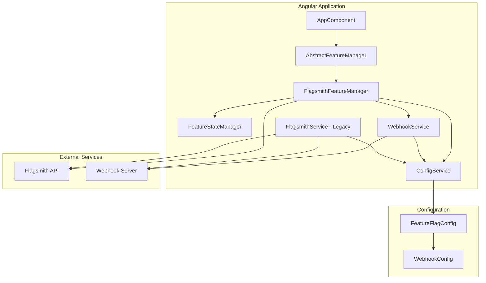
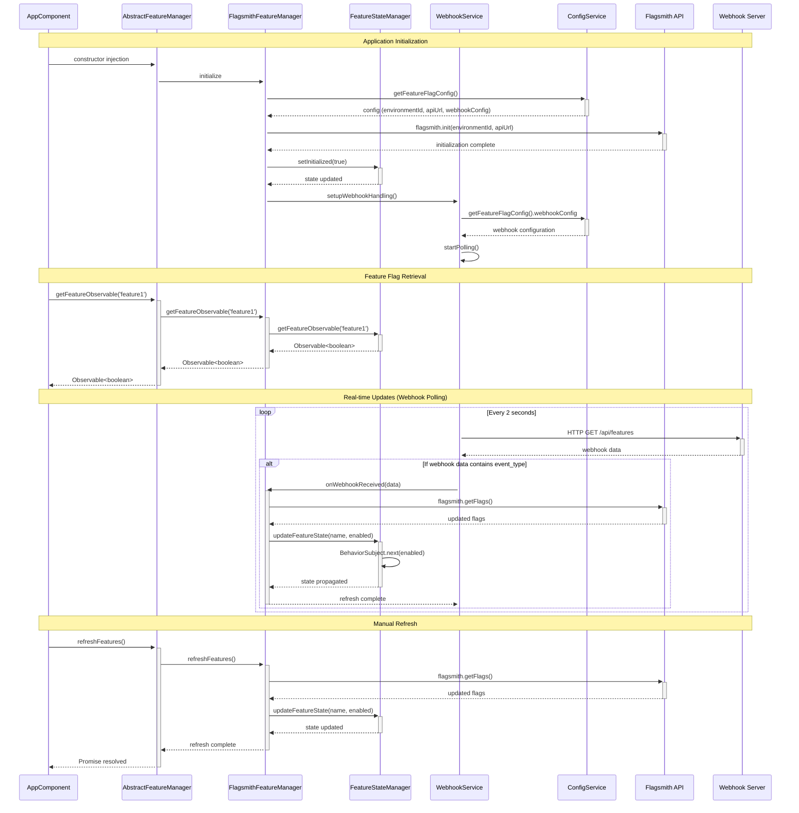
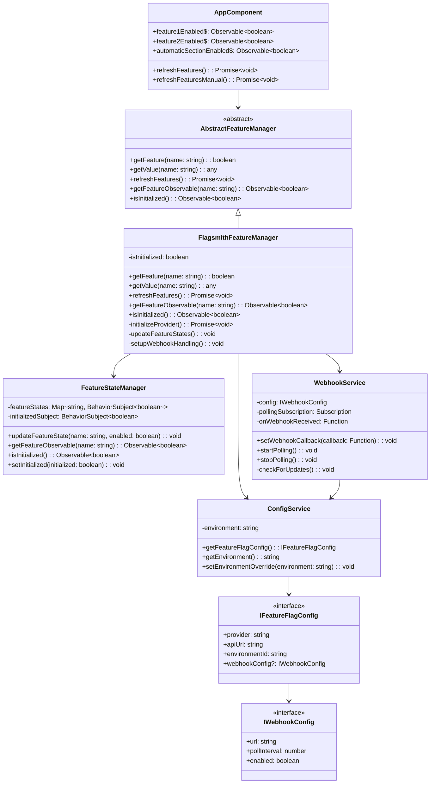
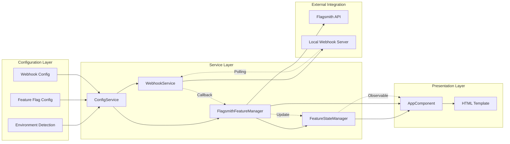

# Angular Feature Flag Flow - UML Diagram

## System Architecture Overview

## Detailed Flow Sequence

## Class Relationship Diagram

## Data Flow Architecture

## Key Features

### 1. **SOLID Principles Implementation**
- **Single Responsibility**: Each service has one clear purpose
- **Open/Closed**: Abstract base class allows for multiple providers
- **Liskov Substitution**: FlagsmithFeatureManager can replace AbstractFeatureManager
- **Interface Segregation**: Separate interfaces for different concerns
- **Dependency Inversion**: Services depend on abstractions, not concretions

### 2. **Real-time Updates**
- Webhook polling every 2 seconds (configurable)
- Automatic feature flag synchronization
- Reactive UI updates using RxJS Observables

### 3. **Configuration Management**
- Environment-based configuration
- Centralized settings in `feature-flag.config.ts`
- No hardcoded values in services

### 4. **State Management**
- BehaviorSubjects for reactive state
- Observable pattern for UI updates
- Centralized feature state management

## Usage Flow

1. **Initialization**: ConfigService determines environment and loads appropriate configuration
2. **Service Setup**: FlagsmithFeatureManager initializes with Flagsmith API using config
3. **Webhook Setup**: WebhookService starts polling local webhook server
4. **UI Binding**: AppComponent subscribes to feature flag observables
5. **Real-time Updates**: Webhook polling detects changes and triggers refresh
6. **State Propagation**: Updated flags flow through observables to UI components